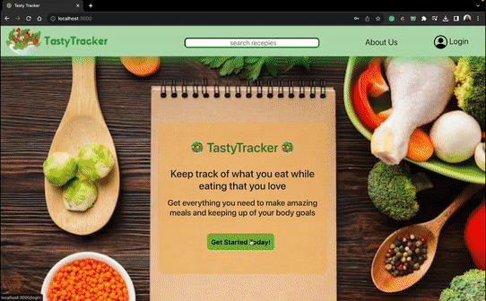

<p align="center">
    <a href=""></a>
    <a href=""></a>
    <br>
    <a href="">
    </a>
    <a href=""></a>
    <a href=""></a>
     <br>
    <a href=""></a>
    <a href=""></a>
     <a href=""></a>

</p>

<h1 align="center"><b>🥗 TastyTracker 🥗</b></h1>
<h4 align="center"> A web application that allows users to search for recipes, keep track of their daily calorie intake, and save favorite meals for later reference.
</h4>

<p align="center">
    
</p>

## Accomplishments

- Implemented **agile methodology** to develop the design strategy for seamless navigation.

- Enhanced the application's security by implementing **user authentication**, where the Flask-Session library was employed to encrypt and protect sensitive identifying account information.

- Engineered an intricate **RESTful database design** involving multiple models, and skillfully established both one-to-many and many-to-many relationships among them 

- Retrieved essential data from two external third-party APIs, specifically designed for **comprehensive food search and recipe searches**, enriching the application with a vast and diverse culinary knowledge base.

- Crafted an i**ntuitive and visually appealing** user interface using with React.js, CSS and Bootstrap framework


## Project Features

- **Calorie Tracking:** TastyTracker enables users to track their daily calorie intake. It calculates and displays the total calories consumed throughout the day.

- **Recipe Search:** Users can search for recipes based on keywords, ingredients, or dietary preferences. The application fetches recipes from external APIs to provide a wide variety of options.

- **Save Meals:** Users can save their favorite recipes or meals for future reference. This feature helps users quickly access recipes they love.

## Installation: 

1. Clone this repository to your local machine:

```bash
git clone git@github.com:sabashahbaz/TastyTracker.git
```

2. Navigate to the project directory:

```bash
cd TastyTracker
```

3. Install the required dependencies using pipenv:

Run the back-end server: 

```bash
cd server
```
```bash
pipenv install && pipenv shell
```
```bash
python app.py
```

Run the front-end server: 
```bash
cd client
```
```bash
npm start 
```


## Upcoming Features 
- Generate meal based on calories available for given meal  
- User will be able to input food measurements, for increased accuracy of caloric intake
- User will be able able to view previous day's food log


## Acknowledgments

My project is a tribute to the transformative impact of the Lose It app, which has greatly helped me reach my body goals and continue a healthy life style.

## License

This project is licensed under the MIT License. See the LICENSE file for details.


